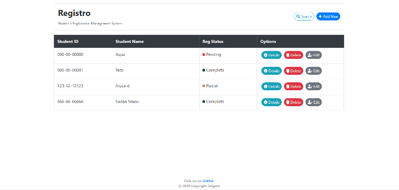

<h1 align="center">Welcome to Registro 👋</h1>
<p align = "center">
  
  <a href="https://github.com/shovon668/registro/blob/main/README.md" target="_blank">
    
  </a>
  <a href="https://github.com/shovon668/registro/blob/main/LICENSE" target="_blank">
    
  </a>
</p>


A simple web app made with flask for managing student's registration & courses information
</div>

<div align = "center">



</div>

### ✨ [Live Demo](https://re.shovon.me/o68)

## Getting started

```sh
# Installing requirements
pip3 install -r requirements.txt

# Starting the app
python3 app.py
```

## Author

👤 **shovon668**

* Website: [shovon.me](https://shovon.me)
* Twitter: [@shovon668](https://redirect.shovon.me/twitter)
* Telegram: [@shovon668](https://redirect.shovon.me/telegram)
* Github: [@shovon668](https://redirect.shovon.me/github)

## 🤝 Contributing

Contributions, issues and feature requests are welcome!<br />Feel free to check [issues page](https://github.com/shovon668/registro/issues). 

## Show your support

Give a ⭐️ if this project helped you!

## 📝 License

Copyright © 2020 [Shovon](https://github.com/shovon668).<br />
This project is [MIT](https://github.com/shovon668/registro/blob/main/LICENSE) licensed.

***